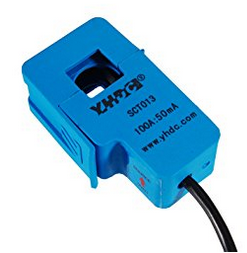
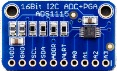
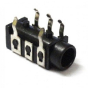
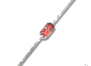
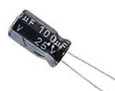
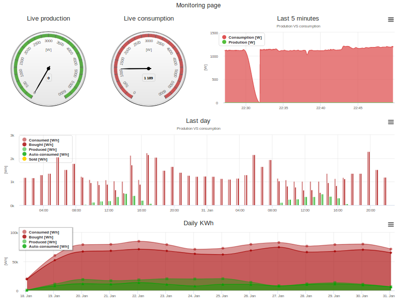

# Home Energy Monitoring System ...

Project to monitor home production (Power one/ABB/Aurora inveters) and consumption

Answers the question on "how much do I spend on energy hourly, daily and yearly".

My setup: 
 - 3KW x 2 PV panel strings
 - ABB PVI-6000-TL-OUTD
 - Access to electric switchboard global switch cabling

## Bill of materials:

1. Amperometric (current) sensor; find it with "current sensor 50mA" at ([amazon](https://www.amazon.it/yhdc-Trasformatore-corrente-sct013-100-50mA/dp/B01EFS7QUE/ref=sr_1_1?s=electronics&ie=UTF8&qid=1515966805&sr=1-1&keywords=current+sensor+50mA)) 

2. ADC converter ADS1115: ([adafruit](https://www.adafruit.com/product/1085)) or amazon

3. A Raspberry PI board (I had a Pi3 @home but even an old one would fit) (amazon) (and USB power adapter)
4. A 3.5" jack female connector (amazon)

5. Four simple pin diodes (amazon)

6. A 160Ohm resistor (or anything that gets you around that value)
7. A 100uF electrolitic capacitor.. let me google that for you

8. A matrix board pcb
9. Anything goes soldering equipment
10. Some boxing to keep the whole thing together.  

## Software
Software is in python, meant to run on Raspberry PI and friends.
To properly run python Flask module should not run via its web server
since it's not meant for production. Instead, WSGI server is
just perfect:

    apt-get install uwsgi

Edit file /etc/rc.local (or anything that allows you to run software at machine bootstrap):

	uwsgi --plugin python --http-socket=0.0.0.0:8000 --enable-threads --manage-script-name --mount /=hems:app

Web app screenshot:

