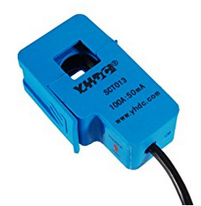
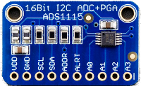
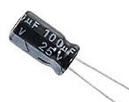

# Home Energy Monitoring System ...

... successful story.

Prerequisites: I've moved to electricity as my source of power for heating / cooling and cooking in my new house. Nice and clean. BUT.. 
 - How much does it cost me on average?
 - How much is that appliance consuming?
 - How close am I to exceeding my electricity distribution company (Enel) power limits?

If one of these questions ever bugged you, you're in the right place.

My setup: 
 - Heating/Cooling : Daikin Rotex Hibrid HPU 8KW [power pump] / 33KW [gas heating boiler]
 - 3KW x 2 PV panel strings
 - ABB PVI-6000-TL-OUTD
 - Enel production power open-meter 

## Bill of materials:

1. Amperometric (current) sensor; find it with "current sensor 50mA" at ([amazon](https://www.amazon.it/yhdc-Trasformatore-corrente-sct013-100-50mA/dp/B01EFS7QUE/ref=sr_1_1?s=electronics&ie=UTF8&qid=1515966805&sr=1-1&keywords=current+sensor+50mA)) 

2. ADC converter ADS1115: ([adafruit](https://www.adafruit.com/product/1085)) or amazon

3. A Raspberry PI board (I had a Pi3 @home but even an old one would fit) (amazon) (and USB power adapter)
4. A 3.5" jack female connector (amazon)

5. Four simple pin diodes (amazon)

6. A 160Ohm resistor (or anything that gets you around that value)
7. A 100uF electrolitic capacitor.. let me google that for you

8. A matrix board pcb
9. Anything goes soldering equipment
10. Some boxing to keep the whole thing together.  

## Time investment 